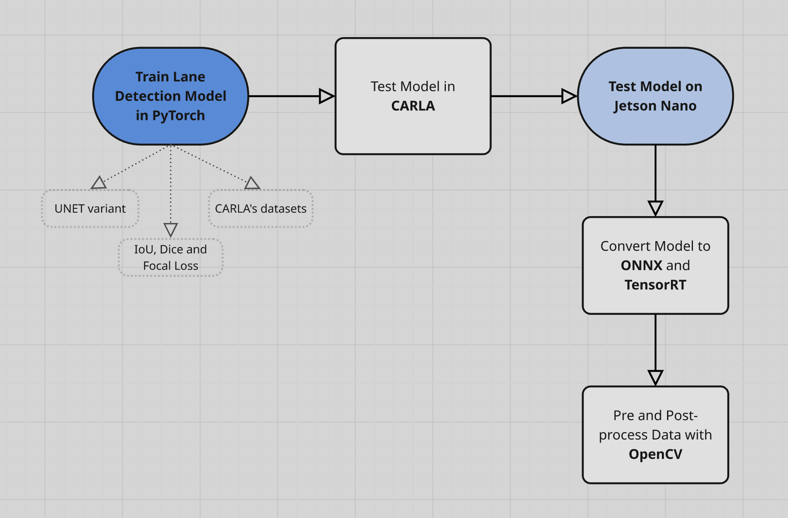

## Project Architecture

A simple explanation of our structure.

If you want to see more on our LaneNet model, please check out [Model README](/pytorch/README.md).

## Lane Keeping Assist - Level 1 Autonomy ADAS feature  

In this project, you will be exposed to the intersection of virtual simulations and real-world applications. You will delve deep into the mechanisms of the Lane Keeping Assist System (LKA), a pivotal Level 1 autonomous driving feature. Using advanced simulation platforms and actual hardware, you will design, test, and implement an LKAS that can operate both virtually and in the real world.

## Background Information

The dream of self-driving cars has been around for decades, long before they became a technical reality. From the early radio-controlled cars showcased in the 1930s World's Fair to the futuristic vehicles in science fiction, autonomous driving has always captured human imagination. The Lane Keeping Assist System is one of the first steps in making this dream come true. It's not just a technical marvel; LKAS plays a crucial role in ensuring safer roads by reducing lane departure incidents.  

## Objectives

1. Design a virtual LKAS capable of detecting and tracking lane markings using simulated sensors.
2. Implement feedback mechanisms to alert virtual drivers of unintentional lane departures.
3. Simulate corrective interventions, such as steering or braking adjustments, to ensure the virtual vehicle remains in its lane.
4. Translate the virtual LKAS system to a real-world application using the PiRacer, ensuring it operates effectively with real sensors and environments.

## Mandatory Part

1. Establish a comprehensive simulation environment using platforms like CARLA or Gazebo. This setup should include a detailed test track and a vehicle embedded with all necessary simulated sensors.
2. Develop algorithms to identify lane markings and determine the vehicle's position relative to them.
3. Implement a feedback system to alert the driver if the vehicle drifts from its lane, using both visual and auditory signals.
4. Create interventions in the simulation to redirect the vehicle back to its lane.
5. Transition from simulation to real-world application by setting up the LKAS on the PiRacer. Integrate necessary sensors and calibrate them to function in real environments.

## Common Instructions

- Always backup your data and code before making major changes.
- When transitioning to real-world testing, always test in controlled environments, ensuring all interventions are gradual and predictable to prevent abrupt movements or potential damage.
- Wear appropriate safety gear when working with hardware components.

## Skills

- Proficiency in simulation platforms such as CARLA or Gazebo.
- Understanding of sensor data processing and algorithmic design for lane detection.
- Integration skills, transitioning from a virtual to a real-world system.
- Calibration and testing skills for real-world hardware systems.
- Proficiency in ML and DL algorithms
- Proficiency in Linear Algebra

# References

Here are some open source references and descriptions that could be used in the Road Surface Segmentation using PiRacer project:

1. OpenCV: OpenCV is a popular open-source computer vision library that provides a wide range of tools and algorithms for image and video processing. Participants could use OpenCV for pre-processing the video footage, extracting features, and identifying the lane markings.
    Link: [https://opencv.org/](https://opencv.org/)
