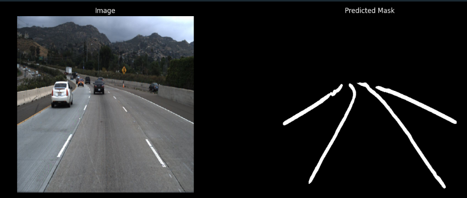
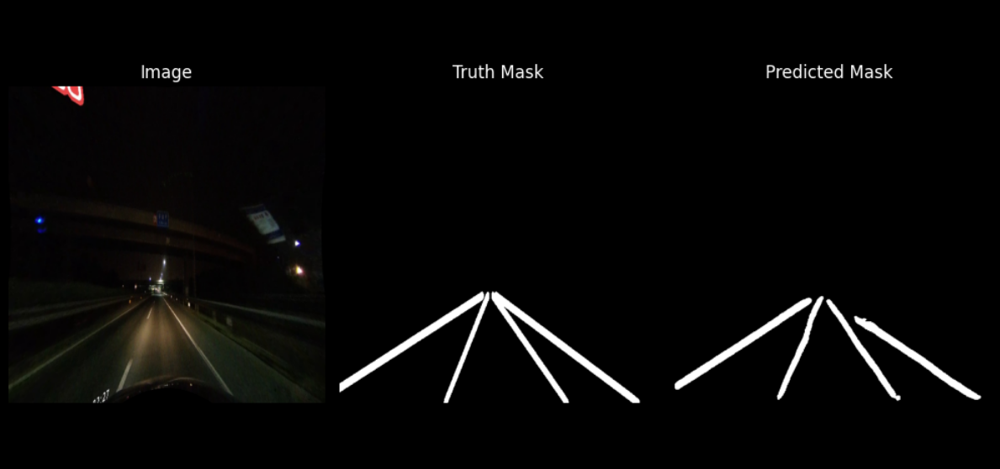
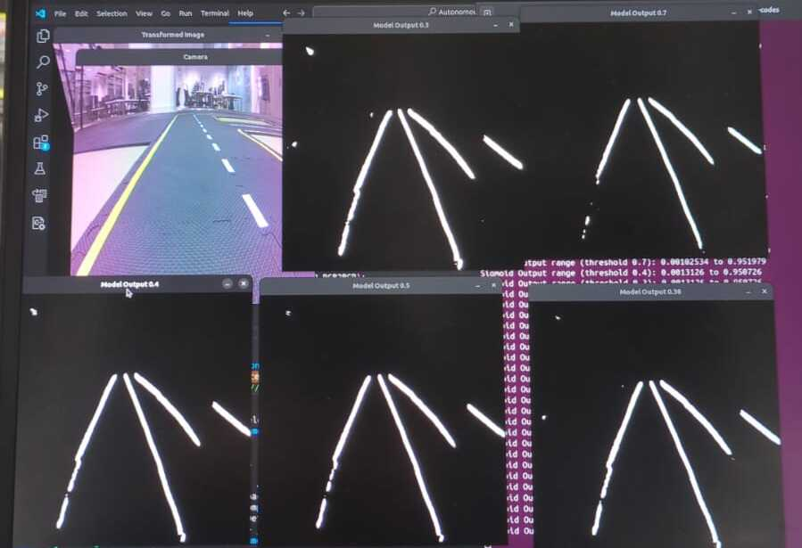

# Lane Detection Model

## Results

These images were captured during training with TUSimple and CULane datasets, after a certain amount of epochs.



This image is in epoch 37, nightime.



This image was taken whilst testing the model in Jetson. Here you see different masks, with different thresholds of values, after applying the activation function **sigmoid**. After removing the fisheye effect of Jetson's camera, the model produced much better results.



Next there are a few videos we recorded while testing the model in CARLA. On one side, you see a CARLA's window, with the vehicle from a top spectator view. On the other side, you see an **OpenCV** window from the car's perspective, with our pytorch model's binary mask overlaying the road.
In intersections, because there is NO lane, we defined that the car should go straight ahead, in the CARLA environment. You can see this behaviour in *carla_setup.py*

Click to see our [LaneNet model on CARLA](results/town4.gif), [Lane detection on CARLA](results/town5.gif).

## Datasets
The datasets we are using to train the model are from: [This is an external link to the Datasets used](https://onedrive.live.com/?id=4EF9629CA3CB4B5E%213022&cid=4EF9629CA3CB4B5E&redeem=aHR0cHM6Ly8xZHJ2Lm1zL3UvcyFBbDVMeTZPY1l2bE9sMDQxNHNSb3BGVkgyOTVXP2U9Q2pjbDYy). We used dataset8 and dataset10. However, we were using TUSimple and CULane beforehand, but couldn't get good results on CARLA, so we decided to switch datasets. For testing, we used dataset11 and **CARLA**. We have a testing script for CARLA in *carla_setup.py*.

## Pytorch Model

We use **OpenCV** to pre and post-process our images, sending them to our Pytorch model. This way we can get the correct results. We also have a *retrain.py* file to train the model even more after its already been saved. The learning rate this way, is a little bit lower than the previous training.
Why use Pytorch and not TensorFlow?
Pytorch is a more user friendly machine learning framework, and the end result will ultimately be the same between the two. We can also convert the Pytorch model to TensorRT to optimize it for Jetson Nano.
Now a little bit on **Neural Networks**, Neural networks (especially **CNNs**) excel at learning spatial hierarchies and feature representations directly from pixel data.
Random Forest might perform well on clean, structured roads but fail on foggy or nighttime roads where lane markings are faint. CNNs, trained on diverse datasets, adapt much better.

## Hyperparameters

Change the **Batch Size** according to your Gpu capabilities, in *dataset.py*.

We are using the **Adam Optimizer** for training, as it is well-suited for segmentation tasks due to its adaptive learning rate mechanism. The optimizer is initialized with a standard learning rate of 0.001. However, we are also using a **learning rate scheduler** to dynamically adjust the learning rate if the loss function shows no improvement over a certain number of epochs. We use a **weight decay** of 1e-4, this helps preventing overfit.

For the loss function, we combine **Focal and Dice Loss**. Focal Loss is effective in handling class imbalance by giving more weight to hard-to-classify examples (the incorrect predictions), which is common in segmentation tasks. On the other hand, Dice Loss is great for segmentation because it focuses on the intersection of predicted and ground truth values, rather than the union, making it more sensitive to smaller, harder-to-detect regions.

Additionally, to combat overfitting, we apply random **Dropouts** in the model's layers during training, which helps prevent the model from depending too much on certain neurons or features, encouraging it to learn more general patterns. We also apply many **Transformations** to the images, such as Horizontal Flip, Motion and Gaussian blur, and color alterations.

We use **Skip Connections** to ensure our model doesn't lose important information from earlier layers.

The following is a brief explanation of our model's layers.

### nn.Conv2d(in_channels, out_channels, kernel_size=3, padding=1):

This is a 2D convolutional layer that applies a kernel/filter of size 3x3 across the input image. Padding ensures the output has the same spatial dimensions as the input, keeping the feature map size the same after convolution.

### nn.ReLU(inplace=True):

Rectified Linear Unit is a non-linear activation function that helps the model learn complex patterns. It outputs the input if it’s positive, or zero if it’s negative. inplace=True means it modifies the input tensor directly, which helps save memory during training.

### nn.GroupNorm(num_groups=32, num_channels=out_channels):

Normalization is the process of scaling and shifting input data or activations so that they have a more stable distribution, usually with zero mean and unit variance. This helps neural networks learn faster and generalize better.

### nn.MaxPool2d(2):

Max Pooling reduces the spatial dimensions (height and width) of the input by taking the maximum value from a 2x2 window. It helps reduce the complexity of the model and focuses on the most important features, providing some translation invariance.

### Decoder (ConvTranspose2d):

This layer is the opposite of a convolution, performing upsampling. This helps increase the spatial dimensions of the feature maps and is used in the decoder part of the network to recreate the original image size.

## Training

To run this code, you need to install all dependencies such as torch, torchvision and pillow (PIL)
To start training the model, insert the right directory path to your training images in *dataset.py*. We advise you to get access to a good enough gpu and run:

```bash
python train.py
```

## Testing

To test the model, insert the right directory path to your testing images, in the same script:

```bash
python testing.py
```

For testing in CARLA, be sure to move carla_setup.py to PythonApi/carla directory in your carla's version folder and run it, after intalling all CARLA's dependencies and running the CARLA's .sh file in another terminal:

```bash
python carla_setup.py
```

## Converting

To convert the pytorch model to **TensorRt**, you need to send the trainned model (.pth) to the **Jetson Nano**, you can do this by running:

```bash
scp ./pytorch/models/retrain.pth okdot5@10.21.221.43:/home/jetracer/
```

After this, run the converting script, be sure to install **ONNX** as well:

```bash
python convert.py
```

After the conversion, you can apply **Pre and Post-processing** strategies in C++ so that the model can work correctly. You can see the processing in python here: **carla_setup.py**.
